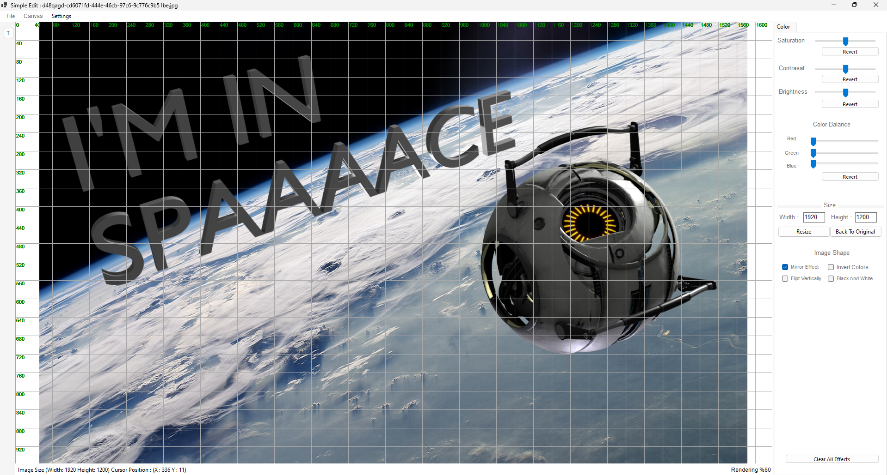

# Image Editing Experiment in WinForms

This project was one of my early experiments when I first started learning C#. I used it to explore basic image editing functionality in WinForms. It primarily consists of spaghetti code and is not the most refined piece of work, but it served as a hobby project at the time.

At one point, I considered incorporating the CUDA framework to improve performance and accelerate certain image processing tasks, but I eventually decided against it and kept the project simple.

While the code quality may not be great, this project represents my initial steps into programming and experimenting with graphical interfaces. I’m sharing it here as a personal milestone and for anyone who might be curious about my early development journey.

