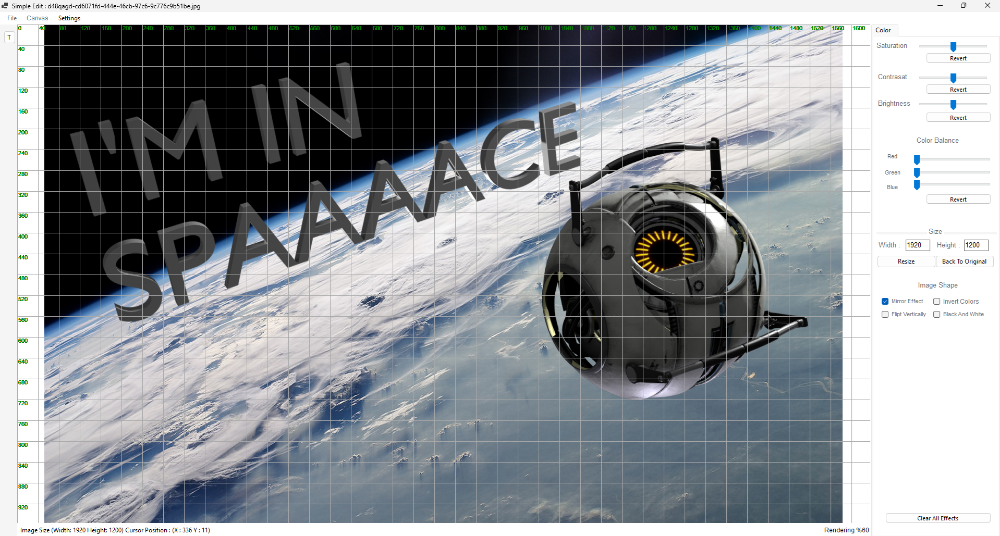

# 🎨 Image Editing Experiment in WinForms

This project was one of my **first experiments** when I started learning C#. It’s a simple **WinForms application** for basic image editing — mostly spaghetti code, but it was a fun hobby project and a great learning experience! 🖥️✨

---

## 🚀 Features

- Adjust **Saturation**  
- Modify **Contrast**  
- Change **Brightness**  
- Apply **Color Balance**  
- Resize images  
- Mirror & Flip (Vertical & Horizontal)  
- Invert Colors  
- Convert to **Black and White**  
- Various simple effects for image manipulation  

---

## 💡 About

At one point, I considered integrating **CUDA** for performance boosts on heavy image processing tasks but ultimately kept it simple to focus on learning fundamentals.  

Though the code quality isn’t perfect, this project marks an important milestone in my programming journey — a hands-on way to understand graphics and WinForms. Sharing it here for anyone curious about my early development steps! 🎉

---

## 📸 Screenshot

